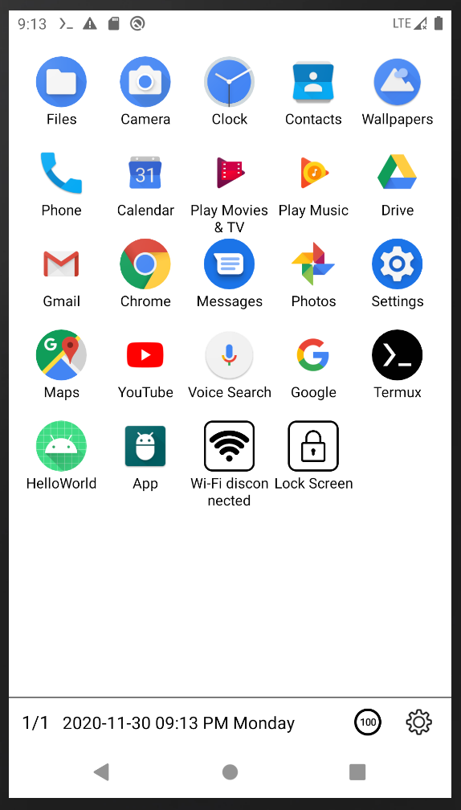
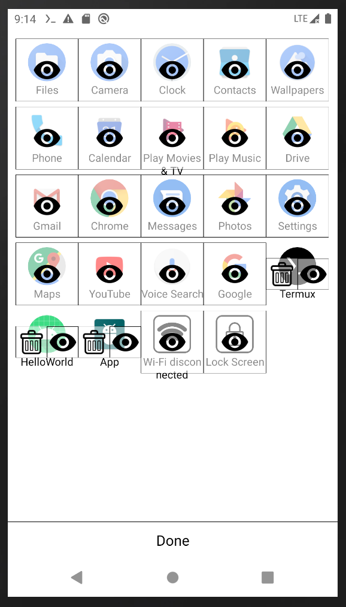
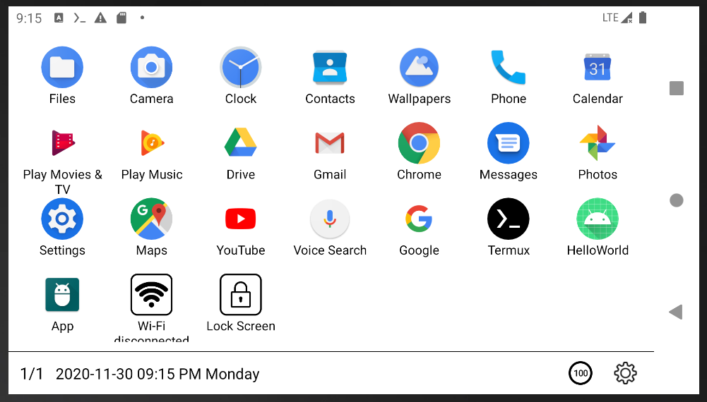
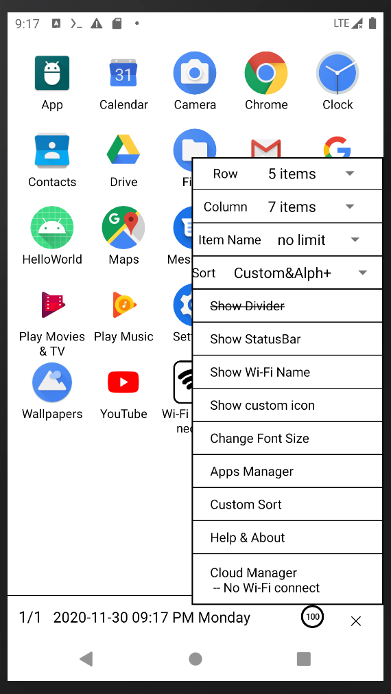
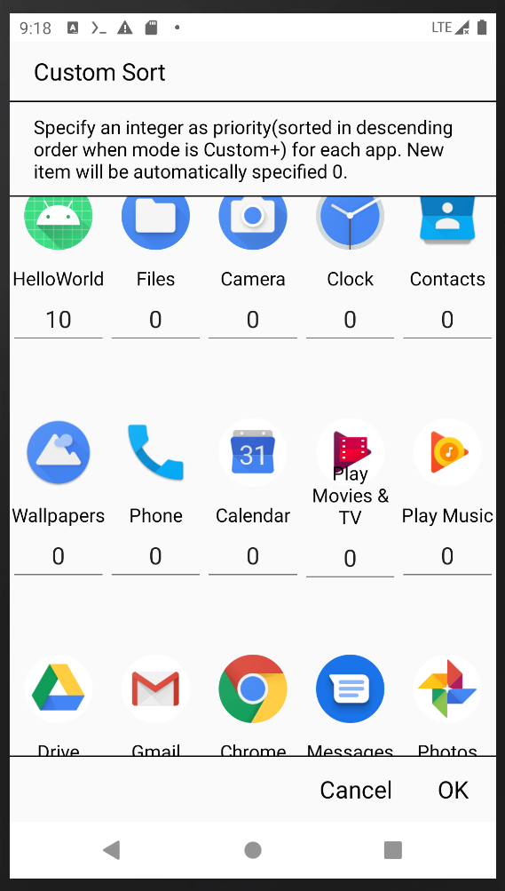

## E-Ink Launcher (shunf4 Mod)

`E-Ink Launcher` is an Android launcher for Electronic paper book. This fork contains shunf4's modification and enhancement:

- fixes some minor bugs
- supports sorting apps
- supports giving priority to apps (manually sorting)
- supports shortcuts (both Android 4.4- and 4.4+ kind of shortcut; you can manually add shortcut in [Shortcut Maker](https://play.google.com/store/apps/details?id=rk.android.app.shortcutmaker) if some shortcuts are intended to be created from the launcher.)

join telegram group https://t.me/EInkLauncher
